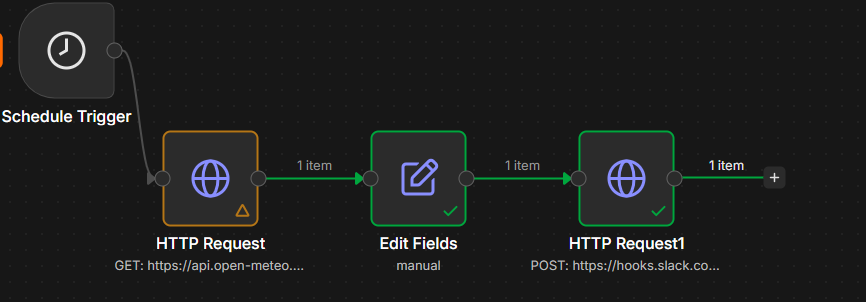
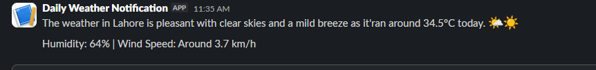

# n8n Weather-to-Slack Automation

An automated workflow built with n8n that fetches live weather data from the Open-Meteo API, uses a locally running Ollama model to generate a natural-language summary, and posts it to a Slack channel on a daily schedule.

---

## Overview

This project covers a full automation pipeline:

- Runs automatically on a daily schedule
- Pulls real-time weather data from the free Open-Meteo API (no API key required)
- Formats the raw API response into readable weather stats
- Sends the stats to a locally running Ollama model (phi3) to generate a short, natural-language summary
- Posts the AI-generated summary to a Slack channel via webhook

---

## Preview

**n8n Workflow Canvas**



**Slack Output**



---

## Tech Stack

| Tool | Purpose |
|---|---|
| n8n | Workflow automation engine (self-hosted locally via Docker) |
| Open-Meteo API | Free weather data source, no auth required |
| Ollama (phi3) | Local LLM used to generate natural-language weather summaries |
| Slack API | Incoming webhook for message delivery |

---

## How It Works

1. **Schedule Trigger** - kicks off the workflow automatically once a day.
2. **HTTP Request Node** - calls the Open-Meteo API to fetch current weather data (temperature, humidity, wind speed) for a set location.
3. **Edit Fields Node** - reformats the raw JSON response into readable weather stats.
4. **HTTP Request Node (Ollama)** - sends the formatted stats to a local Ollama server running the phi3 model, which returns a short, natural-language weather summary.
5. **HTTP Request Node (Slack)** - sends the AI-generated summary to a designated Slack channel via webhook.

---

## Getting Started

### Prerequisites

- n8n installed locally (this project uses the Docker setup)
- Ollama installed locally with the phi3 model pulled: `ollama pull phi3`
- A Slack workspace with an Incoming Webhook set up

### Setup

1. Clone this repository:
   ```bash
   git clone https://github.com/SaribAfzaal/n8n-weather-slack-bot.git
   cd n8n-weather-slack-bot
   ```

2. Import the workflow into n8n:
   - Open n8n
   - Go to Workflows -> Import from File
   - Select `workflow.json` from this repo

3. Add your Slack credentials:
   - Paste your own Incoming Webhook URL into the Slack HTTP Request node
   - This repo's `workflow.json` uses a placeholder URL, not real credentials

4. Set your location:
   - Update the latitude/longitude parameters in the Open-Meteo HTTP Request node

5. Make sure Ollama is running:
   - Start Ollama and confirm the phi3 model is available
   - If n8n is running in Docker, the Ollama node calls `http://host.docker.internal:11434` instead of `localhost` so the container can reach the host machine

6. Activate the workflow:
   - Publish/activate the workflow in n8n so it runs on schedule

---

## Security Note

No API keys, tokens, or webhook URLs are included in this repository. The exported workflow uses placeholder values. You will need to connect your own Slack credentials to run it.

---

## Notes

- Ollama runs locally, so this workflow only fires on schedule if both Docker (n8n) and Ollama are running at the scheduled time.
- The AI-generated summary can vary in tone and length between runs since it is generated fresh each time by the model.

---

## Author

Built by Sarib Afzaal as a portfolio project exploring workflow automation with n8n.